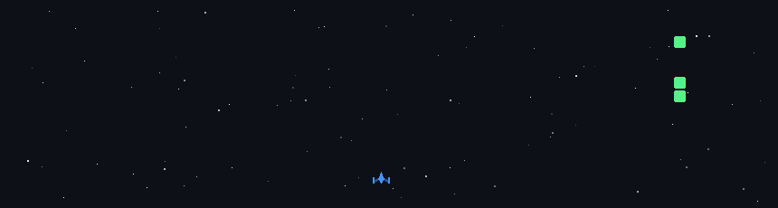

# 💫 About Me:
🔭 I’m currently working on frontend projects using React and JavaScript 👯 I’m looking to collaborate on beginner-friendly web projects 🤝 I’m looking for help with backend development and APIs using Python 🌱 I’m currently learning Data Structures, Python, and React 💬 Ask me about HTML, CSS, JavaScript, and React basics ⚡ Fun fact: I enjoy turning ideas into real websites

## 🌐 Socials:
      

# 💻 Tech Stack:
                                               
# 📊 GitHub Stats:
 
 

### 🔝 Top Contributed Repo

---

<!-- Proudly created with GPRM ( https://gprm.itsvg.in ) -->

  

